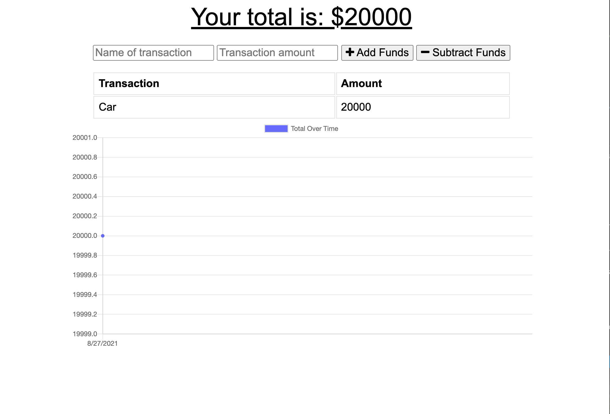

## Progressive Budget

## Description 
This project is a both an online and offline progressive budget tracker. It allows users to add or subtract funds from their budget tracker, thus progressive, and shows the progression on a neat graph.

## Prerequisites
The user should clone the repository from GitHub.

## Installation
Clone this repository. 
- [Repository Link](https://github.com/c1am/progressive-budget) 
- SSH Clone Link: "git@github.com:c1am/progressive-budget.git"
- [Heroku Deployment Link](https://cherrys-progressive-budget.herokuapp.com/)

Install `node.js`, open the terminal and run `npm i` to install the packages below in the format of this example `npm i mysql2` for each package:
- Node.js
- Mongoose
- Express

## Picture of Deployed Application

## Built With
- Javascript
- MySQL
- Node.js
- Heroku
- MongoDB Atlas

## Authors
- Cherry Lam 
    - [GitHub](https://github.com/c1am)
    - [Email](mailto:cherrylam.ny@gmail.com)